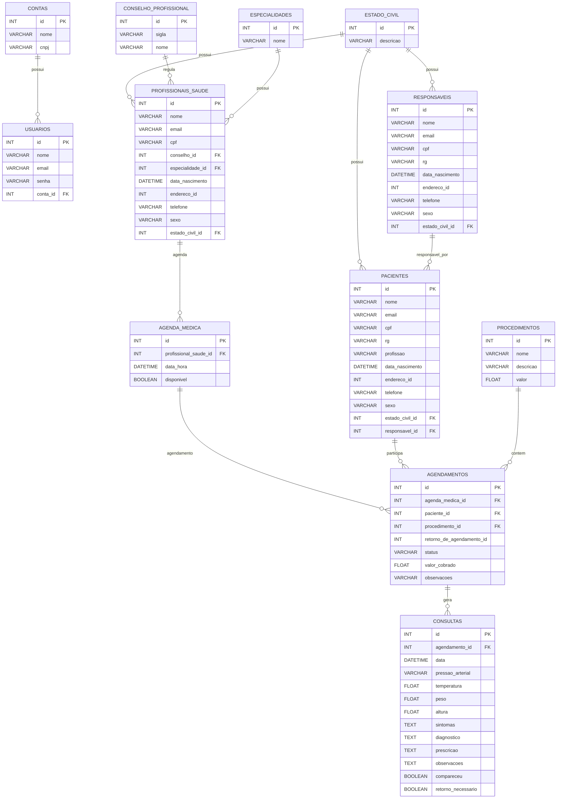

<div align="center">
    <p>
        
    </p>
</div>


<div align="center">
    <p>
        <a href="#">
            
        </a>
        <a href="https://hub.docker.com/r/rogerionasc/gesoft/tags">
            
        </a>
        <a href="https://hub.docker.com/r/rogerionasc/gesoft/tags">
            
        </a>
        <a href="https://hub.docker.com/r/rogerionasc/gesoft/tags">
            
        </a>
        <a href="https://hub.docker.com/r/rogerionasc/gesoft/tags">
            
        </a>
    </p>
</div>

<div align="center">
    <p>
        <a href="#sobre">Sobre</a> |
        <a href="#instalação">Instalação</a> |
        <a href="#funcionalidade">Funcionalidade</a> |
        <a href="#tecnologias">Tecnologia</a> |
        <a href="#créditos">Crédito</a> |
        <a href="#licença">Licença</a>
    </p>
</div>

# Sobre

O `WCode Clinic ERP` é uma solução avançada de Enterprise Resource Planning (ERP) projetada especificamente para otimizar a gestão completa de clínicas, proporcionando uma abordagem integrada e eficiente para todas as operações. Desenvolvido com a mais recente tecnologia, o WCode Clinic ERP oferece uma gama abrangente de funcionalidades para atender às necessidades específicas do setor de saúde.
O WCode Clinic ERP é mais do que um sistema de gestão; é uma parceria na excelência clínica. Ele capacita as clínicas a oferecerem cuidados de saúde de alta qualidade, ao mesmo tempo que simplifica as operações administrativas, impulsionando a eficiência e o sucesso sustentável. Transforme sua clínica com o WCode Clinic ERP - onde a inovação encontra a saúde.

# Instalação

Clonar projeto em uma pasta local:
```sh
git clone https://github.com/rogerionasc/wcode.git wcode
```

Entrar no diretório:

```sh
cd wcode
```

Instalar dependências PHP:

```sh
composer install
```

Instalar dependências NPM:

```sh
npm install
```

Criar uma copia do arquivo .env-exemple:

```sh
cp .env.example .env
```

Gerar a chave da aplicação Laravel:

```sh
php artisan key:generate
```

Executar as migrations no banco de dados:

```sh
php artisan migrate
```

Executar as seeder's no banco de dados:

```sh
php artisan db:seed
```

Buildar o código:

```sh
npm run dev
```

Subir aplicação Laravel (http://localhost:8000/):

```sh
php artisan serve
```

Usuário padrão:

- **Username:** 
- **Password:** 


# Funcionalidade

<table>
    <tr>
        <th>Característica</th>
        <th>Descrição</th>
    </tr>
    <tr>
        <td>
            <p>Cadastro de Pacientes:</p>
        </td>
        <td>
             <p>Gerenciamento completo de informações dos pacientes, incluindo dados pessoais, histórico médico, contatos e registros financeiros.</p>
        </td>
    </tr>
    <tr>
        <td>
            <p>Agendamento de Consultas:</p>
        </td>
        <td>
             <p>Funcionalidade para agendar e gerenciar consultas médicas, exames e procedimentos.</p></p>
        </td>
    </tr>
    <tr>
        <td>
            <p>Prontuário Eletrônico:</p>
        </td>
        <td>
             <p>Armazenamento seguro e acessível eletronicamente de registros médicos, facilitando o acompanhamento do histórico de saúde dos pacientes.</p></p>
        </td>
    </tr>
    <tr>
        <td>
            <p>Prescrição Eletrônica:</p>
        </td>
        <td>
             <p>Possibilidade de prescrever medicamentos de forma eletrônica, com integração a farmácias e controle de estoque.</p>
        </td>
    </tr>
    <tr>
        <td>
            <p>Controle de Estoque:</p>
        </td>
        <td>
             <p>Gestão eficiente do estoque de medicamentos, materiais e equipamentos médicos, evitando desperdícios e garantindo disponibilidade quando necessário.</p>
        </td>
    </tr>
    <tr>
        <td>
            <p>Faturamento e Financeiro:</p>
        </td>
        <td>
             <p>Funcionalidades para emissão de faturas, controle de pagamentos, integração com convênios médicos e gestão de receitas e despesas.</p>
        </td>
    </tr>
    <tr>
        <td>
            <p>Gestão de Recursos Humanos:</p>
        </td>
        <td>
             <p>Controle de informações dos profissionais de saúde, escalas de trabalho, folha de pagamento e gestão de treinamentos.</p>
        </td>
    </tr>
    <tr>
        <td>
            <p>Integração Laboratorial:</p>
        </td>
        <td>
             <p>Possibilidade de prescrever medicamentos de forma eletrônica, com integração a farmácias e controle de estoque.</p>
        </td>
    </tr>
    <tr>
        <td>
            <p>Relatórios e Indicadores:</p>
        </td>
        <td>
             <p>Geração de relatórios gerenciais que oferecem insights sobre o desempenho operacional, financeiro e clínico da instituição.</p>
        </td>
    </tr>
    <tr>
        <td>
            <p>Comunicação Interna:</p>
        </td>
        <td>
             <p>Ferramentas para comunicação interna eficiente entre os membros da equipe médica e administrativa.</p>
        </td>
    </tr>
    <tr>
        <td>
            <p>Acesso Remoto:</p>
        </td>
        <td>
             <p>Acesso seguro às informações do sistema de qualquer lugar, facilitando a colaboração e o acompanhamento remoto.</p>
        </td>
    </tr>
   
    
</table>

# Estrutura do Banco de dados

## 💾 Modelo do Banco de Dados




# Licença

## Licença do WCode Clinic - Versão 1.0

Este é um contrato legal entre o licenciado a WCode Solução e Inovação LTDA. Ao utilizar o software fornecido por WCode Solução e Inovação LTDA, o Usuário concorda com os termos e condições deste contrato.

1. Concessão de Licença:

A WCode Solução e Inovação LTDA concede ao Usuário uma licença não exclusiva e intransferível para usar o Software de acordo com os termos e condições estabelecidos neste contrato, em conformidade com o artigo 7º, inciso VI, da Lei nº 9.610/1998 (Lei de Direitos Autorais).

2. Restrições:

a. O Usuário concorda em não reproduzir, modificar, distribuir ou sublicenciar o Software, total ou parcialmente, sem a permissão expressa por escrito da WCode Solução e Inovação LTDA, conforme previsto no artigo 29, incisos I e III, da Lei nº 9.610/1998.

b. O Usuário concorda em não realizar engenharia reversa, descompilar ou desmontar o Software, exceto na medida permitida por lei, de acordo com o artigo 6º, inciso IV, da Lei nº 9.609/1998 (Lei de Software).

3. Propriedade Intelectual:

Todos os direitos de propriedade intelectual relacionados ao Software são de propriedade exclusiva da WCode Solução e Inovação LTDA, em conformidade com o artigo 8º da Lei nº 9.610/1998. Nada neste contrato concede ao Usuário quaisquer direitos de propriedade intelectual sobre o Software, exceto os expressamente concedidos neste documento.

4. Suporte Técnico:

A WCode Solução e Inovação LTDA pode, a seu critério exclusivo, fornecer suporte técnico para o Software. Tal suporte será regido por termos separados.

5. Isenção de Garantias:

O Software é fornecido "como está", sem garantias de qualquer tipo, expressas ou implícitas, incluindo, mas não se limitando a, garantias de comerciabilidade, adequação a uma finalidade específica e não infração, conforme estabelecido no artigo 26, inciso II, do Código de Defesa do Consumidor.

6. Limitação de Responsabilidade:

Em nenhuma circunstância a WCode Solução e Inovação LTDA será responsável por quaisquer danos diretos, indiretos, incidentais, especiais, exemplares ou consequenciais, incluindo perda de lucros, interrupção de negócios ou perda de dados, de acordo com o artigo 14 do Código de Defesa do Consumidor.

7. Lei Aplicável e Jurisdição:

Este contrato é regido pelas leis da República Federativa do Brasil. As partes concordam que qualquer disputa decorrente deste contrato será resolvida pelos tribunais competentes na jurisdição da sede da WCode Solução e Inovação LTDA.

Ao utilizar o Software, o Usuário concorda com os termos e condições deste contrato, em conformidade com a legislação brasileira vigente.

